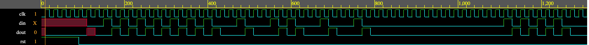

# D-Flip-Flop-RTL-Design-Verification

## Project Overview

This project implements a synchronous D Flip-Flop in SystemVerilog and verifies its functionality using a class-based verification environment.

The verification environment is developed using object-oriented SystemVerilog concepts including:

- Transaction
- Generator
- Driver
- Monitor
- Scoreboard
- Environment
- Mailbox communication
- Virtual Interface
- Events
- Functional checking

---

## RTL Design

The RTL design consists of a synchronous D Flip-Flop with:

- Positive edge triggered clock
- Active-high reset
- Interface-based DUT connection

RTL Source:

```
RTL/dff.sv
```

---

## Verification Environment

The testbench consists of:

```
TB/
├── interface.sv
├── transaction.sv
├── generator.sv
├── driver.sv
├── monitor.sv
├── scoreboard.sv
├── environment.sv
└── top_tb.sv
```

Verification Flow:

Generator
→ Driver
→ DUT
→ Monitor
→ Scoreboard

---

## Simulation Results

Simulation completed successfully.

- Random stimulus generated
- Driver applied transactions
- Monitor captured DUT output
- Scoreboard compared expected and actual outputs
- All transactions matched successfully

Simulation log:

```
Results/simulation.log
```

---

## Waveform

Waveform generated during simulation.



---

## Tools Used

- SystemVerilog
- EDA Playground
- Synopsys VCS
- EPWave

---

## Author

Tirth Bavaliya

Electronics & Communication Engineering

Interested in RTL Design, ASIC Design and Design Verification.
